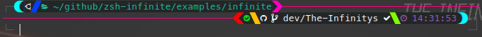

# Infinite Zsh Theme




A highly customizable and dynamic Zsh theme written in Rust. Infinite offers a powerful CLI tool to manage your Zsh prompt's appearance, allowing for dynamic content, sophisticated coloring, and unique visual separators.

## Features

- **Dynamic Zsh Prompt Generation**: Renders left, right, and transient prompts with content sourced from shell commands.
- **Highly Customizable Visuals**:
  - **Colors**: Define background, foreground, primary, secondary, and accent colors.
  - **Accent Colors**: Choose from single colors, rainbow gradients, or custom multi-stop gradients for a vibrant look.
  - **Connection Styles**: Select various line styles (e.g., `Line`, `Double`, `Bold`, `Dashed`, `Dotted`) for prompt segmentation.
  - **Segment Separators**: Utilize different shapes (e.g., `Sharp` Powerline triangles, `Slash`, `Round`, `Wave`) to visually separate prompt segments.
- **Interactive Theme Configuration**: Use the `zsh-infinite theme` command to easily configure your prompt's appearance through an interactive CLI.
- **Easy Installation & Uninstallation**: A dedicated CLI provides commands to set up and remove the theme from your system.
- **Development Utilities**: Includes a `dev` command to test the theme in a clean Zsh environment.

### Prerequisites

- **Rust**: You need to have Rust and Cargo installed. If not, follow the instructions on [rustup.rs](https://rustup.rs/).
- **Zsh**: Ensure Zsh is installed on your system.

## Installation

run

```bash
cargo install --git https://github.com/The-Infinitys/zsh-infinite zsh-infinite
```

then,

```bash
zsh-infinite install
```

The `install` command will:

1. Copy the `zsh-infinite` executable.
2. Create an `infinite.zsh-theme` file.
3. Generate a snippet file in `~/.config/zsh-infinite` to source the theme.
4. Modify your `~/.zshrc` to source the generated snippet.

**Important**: After installation, restart your Zsh session or run `source ~/.zshrc` to apply the changes.

## Usage

The `infinite` Zsh theme will automatically activate after installation.

### Interactive Theme Configuration

To customize your prompt, use the interactive configuration tool:

```bash
zsh-infinite theme
```

This will open a menu

### CLI Commands

The `zsh-infinite` CLI provides the following commands:

- `zsh-infinite install`: Installs the theme and CLI (as described above).
- `zsh-infinite uninstall`: Uninstalls the theme and CLI, reverting changes to `~/.zshrc`.
- `zsh-infinite theme`: Launches the interactive theme configuration UI.
- `zsh-infinite dev`: (Debug only) Starts a clean Zsh session for development and testing.

for more information, run

```bash
zsh-infinite --help
```

## Configuration

Theme configurations are stored in `~/.config/zsh-infinite/theme.yaml`. You can modify this file directly, but it's recommended to use the `zsh-infinite theme` interactive command for easier management.

The configuration allows detailed control over:

- **Colors**: Define colors for various parts of the prompt, including complex accent color gradients.
- **Connection**: Select from predefined connection characters (e.g., single line, double line, bold, dashed) for visual continuity.
- **Separators**: Choose distinct separator styles (e.g., Powerline-style triangles, slashes, rounded edges) for the beginning, middle, and end of prompt segments on both the left and right sides.

### theme example

```yaml
prompt_contents_list:
  - left:
      - cmd: zsh
        args:
          - -c
          - whoami
      - cmd: zsh
        args:
          - -c
          - hostname
    right:
      - cmd: zsh
        args:
          - -c
          - echo ${PWD/#$HOME/\~}
      - cmd: zsh
        args:
          - -c
          - echo $LAST_STATUS
    color:
      bg: Black
      fg: White
      pc: Cyan
      sc: LightBlack
      accent: !single LightBlack
      accent_which: ForeGround
    connection: None
    left_segment_separators:
      start_separator: Sharp
      mid_separator: Sharp
      end_separator: Sharp
      edge_cap: true
      bold_separation: true
    right_segment_separators:
      start_separator: Sharp
      mid_separator: Sharp
      end_separator: Sharp
      edge_cap: true
      bold_separation: true
    accent_which: ForeGround
transient_color:
  bg: Black
  fg: White
  pc: Cyan
  sc: LightBlack
  accent: !single LightBlack
  accent_which: ForeGround
```

for more example, check [Examples dir](./examples/)

## Development

### Building from Source

```bash
git clone https://github.com/the-infinitys/zsh.theme.infinite.git
cd zsh.theme.infinite
cargo build
```

### Testing with `zsh-infinite dev`

To test your changes in a sandboxed Zsh environment without affecting your main Zsh configuration:

```bash
cargo run -- dev
```

This command will set up a temporary `run` directory with a minimal `.zshrc` and `.zsh-theme` that sources your development build of `zsh-infinite`, then launches a new Zsh session.

## Contributing

Contributions are welcome! Please feel free to open issues or submit pull requests.

## License

This project is licensed under the MIT License. See the [LICENSE](LICENSE) file for details.
